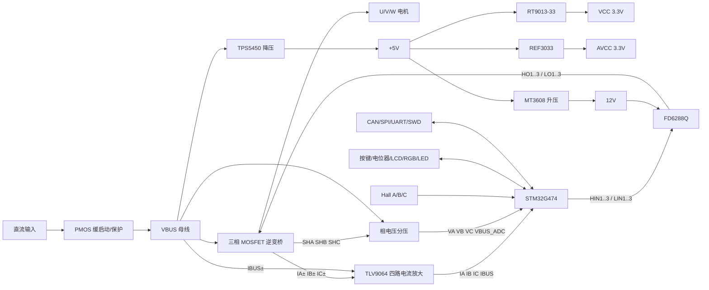

# PMSM_WHOLE 原理图详细说明（AI 可读版）

> 来源：`doc/SCH_Schematic1_2025-08-10.pdf`  
> 输出目的：把单页嘉立创 EDA 原理图转换为可供其他 AI、固件工程师和硬件工程师理解的结构化文字。  
> 文档编码：UTF-8。  
> 原理图标题：`PMSM_WHOLE / Schematic1`，图纸内创建/更新日期均标为 `2024-11-28`；PDF 文件生成时间为 `2025-08-10 19:22:34 +08:00`。

## 0. 阅读约定与可信度

- **“明确”**：元件型号、标号、阻容值、网络名或 MCU 引脚在 PDF 中直接可读。
- **“拓扑推断”**：PDF 是视觉原理图而不是可直接导出的网表；部分连接按导线位置、相同网络标签及典型电路结构还原。
- **“待确认”**：PDF 中存在标注缺失、器件值为空、重复/不一致型号，生产前必须回到嘉立创 EDA 源工程或 PCB 网络表确认。
- 网络名中的端口前缀表示 MCU 管脚，例如 `A0/IA` 表示 `PA0` 上的电流采样信号 `IA`。
- 图中 `VCC` 基本表示数字 3.3 V，`AVCC` 表示模拟 3.3 V，`+5V` 表示 5 V，`12V` 表示栅极驱动电源，`VBUS` 表示电机直流母线。

## 1. 系统功能概览

该电路是一套以 STM32G474 为控制核心的 PMSM/BLDC 三相电机控制器，主要包含：

1. 直流母线输入、PMOS 缓启动/保护及大容量滤波。
2. `VBUS -> 5 V -> 3.3 V` 电源链，以及独立模拟参考/模拟电源。
3. `5 V -> 12 V` 升压，给三相高低侧栅极驱动器使用。
4. STM32G474 主控、25 MHz 外部晶振、SWD/DAPLink 接口。
5. FD6288Q 三相半桥栅极驱动器。
6. 六只功率 MOSFET 组成三相逆变桥。
7. 三相低侧电流及直流母线电流采样，共四路差分放大。
8. 三相相电压及母线电压采样，共四路分压采样。
9. Hall 位置传感器、NTC 温度、调速电位器、按键、RGB、状态 LED、LCD。
10. CAN、SPI、UART 等通信/调试接口。



## 2. 电源网络定义

| 网络 | 标称电压/性质 | 主要来源 | 主要负载 |
|---|---:|---|---|
| `VBUS` | 未在图中写明额定值；实物电压采样按约 25.7 V 满量程设计 | 外部直流输入经 Q2 缓启动 | 三相逆变桥、TPS5450 |
| `+5V` | 5 V | U3 TPS5450 降压 | U4、U5、MT3608、接口和部分指示电路 |
| `VCC` | 3.3 V 数字电源 | U4 RT9013-33GB | STM32、逻辑接口、按键、CAN 收发器逻辑侧等 |
| `AVCC` | 3.3 V 模拟电源/精密参考域 | U5 REF3033 | ADC 模拟前端、TLV9064、VREF 生成 |
| `VREF` | 约 1.65 V 偏置，或可由 MCU DAC 参与设置 | R25/R26、U6、R97（0 Ω）；R96 空贴 | 四路双向电流放大器参考端 |
| `12V` | 约 12 V | U9 MT3608 | U8 FD6288Q、自举二极管 |
| `GND/COM` | 数字/功率参考地 | 输入负端 | 电源、逻辑、功率回路 |
| `VSSA` | MCU 模拟地 | 模拟地 | STM32 ADC 模拟地 |

> 图纸中有“地隔离”字样及 R20、R21 两个 0 Ω电阻，推测用于地网/电源域单点连接或配置。仅凭 PDF 无法可靠恢复两端网络名，PCB 生产前应核对源网表。

## 3. 直流输入、缓启动和母线滤波

### 3.1 输入和缓启动

明确器件：

- `Q2 = WSD90P06DN56`，P 沟道 MOSFET，位于母线高侧。
- `D28 = ZMM12`，12 V 稳压二极管，用于限制 Q2 的栅源电压。
- `Q9 = FMMT493`，NPN 三极管，用于拉低/控制 Q2 栅极。
- `R98 = 5.1 kΩ`、`R99 = 10 kΩ`、`R100 = 1 kΩ`、`R101 = 2 kΩ`、`R102 = 10 kΩ`、`R103 = 1 kΩ`。
- `R14 = 22 Ω`、`R19 = 22 Ω`。
- `C37 = 10 nF`、`C60 = 100 nF`、`C61 = 10 nF`。
- `D27`：图中没有可读型号/数值。
- `CN22`：4 位连接器符号，位于缓启动输入区域；具体插座型号在 PDF 中未明确显示。
- `CN43 = 5012`：单点连接/测试接口，接在 `VBUS` 区域。

拓扑推断：

- 外部直流输入经过高侧 PMOS Q2 后形成 `VBUS`。
- ZMM12 跨接在 Q2 栅源控制区域，防止负向 `VGS` 超过器件允许值。
- Q9 与 RC、阻值网络构成延时开启/受控栅极放电，从而限制大电容上电浪涌。
- 此部分并非专用热插拔控制器，软启动时间和浪涌能力取决于 Q2、Q9、RC 网络以及后级总电容；需要在真实输入电压和负载下验证 Q2 的 SOA。

### 3.2 母线滤波

- `C23 = 220 µF`
- `C24 = 220 µF`
- `C25~C30 = 10 µF`
- `C31~C36 = 10 µF`

即图中至少布置 `440 µF` 大电解/大容量储能，以及 12 只 10 µF 并联去耦。它们位于 `VBUS` 滤波区域，用于降低三相 PWM 电流造成的母线纹波。

## 4. VBUS 降压到 5 V

### 4.1 主降压 U3

- `U3 = TPS5450QDDARQ1`
- 引脚标注：`BOOT(1)`、`NC(2)`、`NC(3)`、`VSENSE(4)`、`ENA(5)`、`GND(6)`、`VIN(7)`、`PH(8)`、`EP(9)`。
- `L1 = 10 µH`
- `D7 = SS54`
- `C63 = 10 µF`，输入侧。
- `C64 = 10 nF`，BOOT 自举电容。
- `C42 = 220 µF`，5 V 输出大电容。
- `C111 = 100 nF`，输入高频去耦。
- `R23 = 10 kΩ`，反馈上臂。
- `R24 = 3.24 kΩ`，反馈下臂。
- `CN3 = 5012`，5 V/开关节点附近单点接口。

按 TPS5450 典型 `VREF_FB ≈ 1.221 V` 估算：

```text
VOUT = 1.221 × (1 + R23/R24)
     = 1.221 × (1 + 10k/3.24k)
     ≈ 4.99 V
```

因此本级明确设计为 `VBUS -> +5V`。

## 5. 5 V 到数字 3.3 V

- `U4 = RT9013-33GB`，固定 3.3 V LDO。
- `VIN -> +5V`
- `VOUT -> VCC`
- `C43 = 1 µF`，输入侧。
- `C65 = 1 µF`，输出侧。
- `CN4 = 5012`，VCC/电源测试接口。

输出 `VCC` 是 MCU 数字电源和大部分 3.3 V 逻辑电路电源。

## 6. 模拟 3.3 V、VREF 偏置

### 6.1 模拟电源/基准 U5

- `U5 = REF3033AIDBZR`
- `IN -> +5V`
- `OUT -> AVCC`
- `C66 = 100 nF`
- `C67 = 1 µF`
- `CN5 = 5012`，AVCC 测试接口。

U5 生成精度较高的 3.3 V `AVCC`，用于模拟采样链。

### 6.2 中点偏置 U6

- `U6 = LM321MFX/NOPB`
- `R25 = 10 kΩ`
- `R26 = 10 kΩ`
- `C110 = 100 nF`
- `R96`：空贴（DNP，不装配）。
- `R97 = 0 Ω`：实际装配。
- 输入网络还连接 `PA4/A4/DAC`。
- 输出网络为 `VREF`。

拓扑推断：

1. R25/R26 从 `AVCC` 分压得到约 `AVCC/2 = 1.65 V`。
2. U6 将该中点缓冲，形成低阻抗 `VREF`。
3. R96/R97 是偏置来源配置位，允许在固定分压和 MCU `PA4 DAC` 支路之间进行硬件选择；实际装配为 **R96 空贴、R97 焊接 0 Ω**，因此启用 R97 所在支路并断开 R96 所在支路。
4. `VREF` 接到四路电流差分放大器的基准端，使双向电流在 0 A 时输出位于 ADC 中点附近。

> 已确认实际装配：**R96 空贴，R97 为 0 Ω**。维护或改版时不得同时焊接 R96、R97，以免两个偏置源互相驱动。

## 7. 5 V 升压到 12 V

- `U9 = MT3608L`
- `L2 = 10 µH`
- `D9 = SS16`
- `R28 = 5.1 kΩ`
- `R29 = 100 kΩ`
- `C70 = 10 µF`、`C71 = 100 nF`：输入滤波。
- `C72 = 10 µF`、`C73 = 100 nF`：输出滤波。
- `CN6 = 5012`、`CN44 = 5012`：电源/测试接口。
- 输入 `+5V`，输出网络 `12V`。

按 MT3608 常用反馈基准约 0.6 V 估算：

```text
VOUT ≈ 0.6 × (1 + 100k/5.1k)
     ≈ 12.36 V
```

元件公差和芯片实际反馈基准会使输出略有差异，图纸将该网络命名为 `12V`。

## 8. MCU 主控 U1

### 8.1 型号确认

- U1 元件值文字显示 `STM32G474RBT6`。
- 图纸右下又标有 `STM32G474RET6`。
- 当前固件工程、`.ioc` 文件和项目名称使用 `STM32G474RETx/RET6`，且图中封装引脚编号为 64 引脚。

实际器件已确认是 **STM32G474RET6（LQFP64）**。PDF 中的 `STM32G474RBT6` 是旧值或误标，后续分析、固件配置和物料管理均应以 `STM32G474RET6` 为准。

### 8.2 主要引脚/网络映射

| MCU 引脚 | 图中网络 | 功能 | 固件 `.ioc` 对应 |
|---|---|---|---|
| PC0 | `C0/VA` | A 相开关节点电压采样 | ADC2_IN6，工程标签 SHA |
| PC1 | `C1/VB` | B 相开关节点电压采样 | ADC2_IN7，工程标签 SHB |
| PC2 | `C2/VC` | C 相开关节点电压采样 | ADC2_IN8，工程标签 SHC |
| PC3 | `C3/APH4` | TIM1_CH4，可能用于 ADC 触发/比较时序 | TIM1_CH4 |
| PA0 | `A0/IA` | A 相电流 ADC | ADC1_IN1 |
| PA1 | `A1/IB` | B 相电流 ADC | ADC1_IN2 |
| PA2 | `A2/IC` | C 相电流 ADC | ADC1_IN3 |
| PA3 | `A3/IBUS` | 母线电流 ADC | ADC1_IN4 |
| PA4 | `A4/DAC` | 可编程模拟偏置 | DAC/模拟输出用途 |
| PA5 | `A5/RGB` | 可寻址 RGB 数据输出 | TIM2_CH1 |
| PA6 | `A6/HALL_A` | Hall A | GPIO 输入，上拉 |
| PA7 | `A7/HALL_B` | Hall B | GPIO 输入，上拉 |
| PC4 | `C4/ADSPE` | 调速电位器 ADC | ADC2_IN5，固件标签 POT |
| PC5 | `C5/VBUS` | 母线电压 ADC | ADC2_IN11 |
| PB0 | `B0/HALL_C` | Hall C | GPIO 输入，上拉 |
| PB1 | `B1/NTC1` | 温度采样 1 | 模拟输入用途，`.ioc` 当前未见完整 ADC 配置 |
| PB10 | `B10/UART3_TX` | USART3 TX | USART3_TX |
| PB11 | `B11/UART3_RX` | USART3 RX | USART3_RX |
| PB12 | `B12/NTC2` | 温度采样 2 | 模拟输入用途，`.ioc` 当前未见完整 ADC 配置 |
| PB13 | `B13/LIN1` | A 相低侧 PWM | TIM1_CH1N |
| PB14 | `B14/LIN2` | B 相低侧 PWM | TIM1_CH2N |
| PB15 | `B15/LIN3` | C 相低侧 PWM | TIM1_CH3N |
| PC6 | `C6/KEY1` | 按键 1 | GPIO 输入 |
| PC7 | `C7/KEY2` | 按键 2 | GPIO 输入 |
| PC8 | `C8/KEY3` | 按键 3 | GPIO 输入 |
| PC9 | `C9/KEY4` | 按键 4 | GPIO 输入 |
| PA8 | `A8/HIN1` | A 相高侧 PWM | TIM1_CH1 |
| PA9 | `A9/HIN2` | B 相高侧 PWM | TIM1_CH2 |
| PA10 | `A10/HIN3` | C 相高侧 PWM | TIM1_CH3 |
| PA11 | `A11/CAN_RX` | CAN RX | FDCAN 接收功能 |
| PA12 | `A12/CAN_TX` | CAN TX | FDCAN 发送功能 |
| PA13 | `SWDIO` | SWD 数据 | 调试口 |
| PA14 | `SWCLK` | SWD 时钟 | 调试口 |
| PA15 | `A15/LCD_RES` | LCD 复位 | GPIO 输出 |
| PC10 | `C10/LCD_SCK` | LCD SPI 时钟 | SPI3_SCK |
| PC11 | `C11/LCD_DC` | LCD D/C | GPIO 输出 |
| PC12 | `C12/LCD_SDA` | LCD SPI MOSI | SPI3_MOSI |
| PD2 | `D2/CSN` | 外部 SPI 片选 | GPIO 输出 |
| PB3 | `B3/SCK` | SPI1 SCK | SPI1_SCK |
| PB4 | `B4/MISO` | SPI1 MISO | SPI1_MISO |
| PB5 | `B5/MOSI` | SPI1 MOSI | SPI1_MOSI |
| PB6 | `B6/LCD_CS` | LCD 片选 | GPIO 输出 |
| PF0/PF1 | `O_IN/O_OUT` | 25 MHz HSE | 外部晶振 |
| PG10 | `NRST` | MCU 复位 | 复位网络 |
| PC13/14/15 | `LED1/LED2/LED3` | 三路状态灯 | GPIO |

### 8.3 时钟和去耦

- `CRYSTAL1 = 25 MHz`
- `C109 = 12 pF`
- `C13 = 12 pF`
- MCU 电源附近可见多组 100 nF + 10 µF：
  - `C52 = 100 nF`，`C54 = 10 µF`
  - `C53 = 100 nF`，以及邻近 10 µF 电容
  - `C55 = 100 nF`，`C56 = 10 µF`
  - `C48 = 1 µF`，`C49 = 100 nF`，用于模拟电源附近
  - `C50 = 10 µF`，`C51 = 100 nF`
  - `C2 = 10 µF`，`C3 = 100 nF`

## 9. DAPLink/SWD 调试接口

- `H1 = ZX-PZ2.54-2-5PZZ`，2×5、2.54 mm 排针。
- 引出的可读网络：`SWCLK`、`SWDIO`、`NRST`、`B10/UART3_TX`、`B11/UART3_RX`、`+5V`。
- `D1 = SMF3.3A`
- `D2 = SMF3.3A`
- `D3 = SMF5.0A`
- `D4` 型号未标明。

这些 TVS/保护二极管分别保护 3.3 V 调试信号和 5 V 电源。PDF 中连接器针号与各信号的逐针对应不够清晰，烧录线制作前应查原 EDA 网表。

## 10. 三相栅极驱动

### 10.1 驱动芯片 U8

- `U8 = FD6288Q`，三相高低侧栅极驱动器，带裸焊盘 EP。
- 输入：`HIN1/2/3`、`LIN1/2/3`。
- 输出：`HO1/2/3`、`LO1/2/3`。
- 高侧供电/浮动节点：`VB1/2/3`、`VS1/2/3`。
- 相节点网络：`SHA`、`SHB`、`SHC`。
- 逻辑电源引脚图中标为 `VCC`，功率驱动及自举由 `12V` 网络提供。
- `COM` 为驱动器参考地，`EP` 应按器件数据手册连接并充分散热。

### 10.2 MCU 到驱动器输入

| MCU PWM 网络 | 串联电阻 | U8 输入 |
|---|---:|---|
| `PA8/HIN1` | `R109 = 22 Ω` | `HIN1` |
| `PA9/HIN2` | `R108 = 22 Ω` | `HIN2` |
| `PA10/HIN3` | `R107 = 22 Ω` | `HIN3` |
| `PB13/LIN1` | `R104 = 22 Ω` | `LIN1` |
| `PB14/LIN2` | `R105 = 22 Ω` | `LIN2` |
| `PB15/LIN3` | `R106 = 22 Ω` | `LIN3` |

### 10.3 自举网络

| 相 | 自举二极管 | 自举电容 | 浮动电源 | 相节点 |
|---|---|---:|---|---|
| A | `D8 = B16WS` | `C69 = 1 µF` | `VB1` | `SHA` |
| B | `D25 = B16WS` | `C74 = 1 µF` | `VB2` | `SHB` |
| C | `D26 = B16WS` | `C75 = 1 µF` | `VB3` | `SHC` |

拓扑为：`12V -> 自举二极管 -> VBx`，`Cbootstrap` 接在 `VBx` 与 `SHx/VSx` 之间。低侧导通时给电容充电，高侧开通时提供高于相节点的栅极驱动电压。

## 11. 三相逆变桥

### 11.1 功率 MOSFET

- `Q3~Q8 = CJAC13TH06`
- 每只器件使用多并联漏极/源极引脚的功率封装符号。
- 高侧：`Q3(A)`、`Q5(B)`、`Q7(C)`，漏极接 `VBUS`，源极接相节点。
- 低侧：`Q4(A)`、`Q6(B)`、`Q8(C)`，漏极接相节点，源极经对应电流分流器回到功率地/母线回路。

### 11.2 栅极网络

| 相/桥臂 | 驱动 | 串联栅极电阻 | 栅源下拉 | 并联二极管 | 测试点 |
|---|---|---:|---:|---|---|
| A 高侧 Q3 | `HO1` | `R48 = 22 Ω` | `R49 = 10 kΩ` | `D15` 未标值 | `CN9 = 5012` |
| A 低侧 Q4 | `LO1` | `R50 = 22 Ω` | `R51 = 10 kΩ` | `D16` 未标值 | `CN11 = 5012` |
| B 高侧 Q5 | `HO2` | `R53 = 22 Ω` | `R54 = 10 kΩ` | `D17` 未标值 | `CN13 = 5012` |
| B 低侧 Q6 | `LO2` | `R55 = 22 Ω` | `R56 = 10 kΩ` | `D18` 未标值 | `CN15 = 5012` |
| C 高侧 Q7 | `HO3` | `R58 = 22 Ω` | `R59 = 10 kΩ` | `D19` 未标值 | `CN17 = 5012` |
| C 低侧 Q8 | `LO3` | `R60 = 22 Ω` | `R61 = 10 kΩ` | `D20` 未标值 | `CN19 = 5012` |

D15~D20 很可能与栅极电阻形成不同开通/关断阻抗，但图中未给具体二极管型号和极性文字；不能仅凭 PDF 判断快速开通还是快速关断方向。

### 11.3 相节点和电机接口

- 相 A：`SHA`
- 相 B：`SHB`
- 相 C：`SHC`
- `U12` 为电机接口符号，5 位结构中明确可读：
  - pin 1 -> `SHA`
  - pin 2 -> `SHB`
  - pin 3 -> `SHC`
  - pin 4、5 未显示有效网络名，可能是机械脚/未连接脚，待确认。

## 12. 电流采样

### 12.1 分流电阻

- `R52 = 1 mΩ`：A 相低侧电流。
- `R57 = 1 mΩ`：B 相低侧电流。
- `R62 = 1 mΩ`：C 相低侧电流。
- `R63 = 1 mΩ`：直流母线/总回流电流。

差分网络：

- A 相：`IA+`、`IA-`
- B 相：`IB+`、`IB-`
- C 相：`IC+`、`IC-`
- 母线：`IBUS+`、`IBUS-`

拓扑推断：低侧 MOSFET 源极首先经过各相 1 mΩ分流器，三路回流再进入公共回流；R63 提供额外总母线电流检测。实际 Kelvin 取样和公共点必须以 PCB 走线为准。

### 12.2 运放 U13

- `U13 = TLV9064IPWR`，四路运算放大器。
- `U13.1`：A 相电流。
- `U13.2`：B 相电流。
- `U13.3`：C 相电流。
- `U13.4`：母线电流。
- 供电：`AVCC`，参考：`VREF`。

每路的核心阻值相同：输入电阻 1 kΩ、反馈/参考电阻 30 kΩ，因此差分增益约 30。

| 通道 | 输入电阻 | 30 kΩ电阻 | ADC 串阻 | 滤波电容 | MCU 输出网络 |
|---|---|---|---:|---|---|
| A | `R64/R66 = 1 kΩ` | `R65/R67 = 30 kΩ` | `R68 = 22 Ω` | `C86 = 100 nF`, `C85 = 1 nF` | `PA0 / IA` |
| B | `R69/R70 = 1 kΩ` | `R71/R72 = 30 kΩ` | `R73 = 22 Ω` | `C87 = 100 nF`, `C88 = 1 nF` | `PA1 / IB` |
| C | `R74/R75 = 1 kΩ` | `R76/R77 = 30 kΩ` | `R78 = 22 Ω` | `C89 = 100 nF`, `C90 = 1 nF` | `PA2 / IC` |
| 母线 | `R79/R80 = 1 kΩ` | `R81/R82 = 30 kΩ` | `R83 = 22 Ω` | `C91 = 100 nF`, `C92 = 1 nF` | `PA3 / IBUS` |

理想传递关系：

```text
VADC ≈ VREF + 30 × (VSHUNT+ - VSHUNT-)
I    = (VADC - VREF) / (30 × 0.001Ω)
     = (VADC - VREF) / 0.03
```

因此：

- 灵敏度约 `30 mV/A`。
- 若 `VREF = 1.65 V` 且 ADC 范围 0~3.3 V，理想双向量程约 `±55 A`。
- 实际量程还受 TLV9064 输入共模、输出摆幅、分流电阻功率和 PCB 热设计限制。
- 1 mΩ分流器功耗：`P = I² × 0.001`；例如 30 A 时约 0.9 W，50 A 时约 2.5 W。

> C85~C92 的确切连接位置应以源网表确认；PDF 可确定元件属于对应通道，但仅凭文本提取不能 100%确定每只电容是反馈并联还是 ADC 端对地滤波。

## 13. 相电压和母线电压采样

四路结构完全相同：两个 15 kΩ串联作为上臂，一个 2 kΩ作为下臂，ADC 节点带 100 nF 滤波和 3.3 V TVS/钳位器件。

| 被测网络 | 上臂 | 下臂 | 保护 | 电容 | MCU ADC |
|---|---|---:|---|---:|---|
| `SHA` | `R84 + R85 = 15 kΩ + 15 kΩ` | `R86 = 2 kΩ` | `D21 = SMF3.3A` | `C93 = 100 nF` | `PC0 / VA` |
| `SHB` | `R87 + R88 = 15 kΩ + 15 kΩ` | `R89 = 2 kΩ` | `D22 = SMF3.3A` | `C94 = 100 nF` | `PC1 / VB` |
| `SHC` | `R90 + R91 = 15 kΩ + 15 kΩ` | `R92 = 2 kΩ` | `D23 = SMF3.3A` | `C95 = 100 nF` | `PC2 / VC` |
| `VBUS` | `R93 + R94 = 6.8 kΩ + 6.8 kΩ`（实物） | `R95 = 2 kΩ` | `D24 = SMF3.3A` | `C96 = 100 nF` | `PC5 / VBUS` |

分压比（实物确认）：

```text
相电压 SHA/SHB/SHC：
Kphase = 2k / (15k + 15k + 2k) = 1/16
VADC_phase = VIN_phase / 16

母线 VBUS：
Kvbus = 2k / (6.8k + 6.8k + 2k) = 1/7.8
VADC_vbus = VBUS / 7.8
VBUS = VADC_vbus × 7.8
```

按 3.3 V ADC 满量程估算，实物 VBUS 被测电压理论满量程约 `25.74 V`。考虑电阻误差、TVS 漏电、ADC 误差和过压裕量，固件中不应把 `25.74 V` 当作安全工作电压上限。
低通滤波近似：

```text
Rth = (13.6k || 2k) ≈ 1.744kΩ
fc  ≈ 1 / (2π × 1.744k × 100nF)
    ≈ 913 Hz
```

该滤波会明显衰减 PWM 高频分量；用于反电动势/相电压重构时，采样相位与数字补偿需要考虑该延迟。

## 14. CAN 通信

- `U7 = SN65HVD232DR`
- 逻辑侧：
  - MCU `PA12/A12/CAN_TX` -> U7 驱动输入。
  - U7 接收输出 -> MCU `PA11/A11/CAN_RX`。
- 总线侧：`CAN_H`、`CAN_L`。
- `R27 = 120 Ω`，CAN 终端匹配电阻。
- `CN8` 为 4 位 CAN 接口，明确包含 `CAN_H`、`CAN_L`；电源/地针号应从源网表确认。
- `CN7 = 5012`，CAN/电源区域测试点。
- U7 电源在图中标为 `VCC`，同时附近出现 `+5V` 标签；SN65HVD232 通常是 3.3 V CAN 收发器，因此实际供电脚连接必须以 PCB 网表为准，避免按 PDF 文字位置误读。

## 15. Hall 传感器接口

- `U11`：7 位 Hall 接口。
- 信号：`HALL_A`、`HALL_B`、`HALL_C`。
- MCU：PA6、PA7、PB0。
- `D12/D13/D14`：三路信号保护二极管，型号未标。
- `R35/R36/R37 = 10 kΩ`
- `R38/R39/R40 = 10 kΩ`
- `R41/R42/R43 = 10 kΩ`
- `C77/C78/C79 = 1 µF`
- 固件 `.ioc` 对三路 Hall 输入启用了内部上拉。

拓扑推断：每路 Hall 输入带外部偏置、限流/滤波和保护。接口还包含电源和地，图中可见 `VCC`，但具体针号应由源网表确认。

## 16. 温度采样

两路网络：

- `PB1 / B1/NTC1`
- `PB12 / B12/NTC2`

元件：

- `R44 = 10 kΩ`
- `R46 = 10 kΩ`
- `R45`、`R47`：PDF 中没有可读阻值，可能为 NTC 外接位、DNP 或元件值漏标。
- `C80 = 100 nF`
- `C81 = 100 nF`

拓扑推断：每路为 10 kΩ固定电阻 + NTC 构成的分压，100 nF 对 ADC 节点滤波。温度换算必须知道 R45/R47 或外接 NTC 的标称阻值、B 值和上/下拉方向，目前 PDF 信息不足。

## 17. 调速电位器

- `PR1 = 10 kΩ`
- 滑动端网络：`PC4 / C4/ADSPE`
- `R8 = 10 kΩ`
- `C47 = 100 nF`
- `CN1 = 5012`
- 供电 `VCC`。

功能：输出约 0~3.3 V 的速度/目标值模拟输入，进入 ADC2_IN5。

## 18. 按键与复位

全部按键型号：`TSB008A2518A`。

| 元件 | 网络/功能 | 上拉/下拉 | 滤波 |
|---|---|---:|---:|
| `SW1` | `KEY1 / PC6` | `R5 = 10 kΩ` | `C44 = 100 nF` |
| `SW2` | `KEY2 / PC7` | `R6 = 10 kΩ` | `C45 = 100 nF` |
| `SW3` | `KEY3 / PC8` | `R7 = 10 kΩ` | `C46 = 100 nF` |
| `SW5` | `KEY4 / PC9` | `R30 = 10 kΩ` | `C76 = 100 nF` |
| `SW4` | `NRST` | `R9 = 40 kΩ` | `C58 = 100 nF` |

图中按键另一端接地/电源的方向需结合导线确认；从常见 STM32 设计推断，KEY 和 NRST 均为上拉、按下拉低。

## 19. LED 和 RGB

### 19.1 MCU 状态 LED

- 逻辑网络：`PC13/LED1`、`PC14/LED2`、`PC15/LED3`。
- 串联电阻：`R2/R3/R4 = 1 kΩ`。
- 对应 LED 元件标号在图中为 `LED2`、`LED5`、`LED4`，逻辑名与物料标号不完全一致。

### 19.2 可寻址 RGB

- `LED1` 为 4 引脚器件，针脚标注 `GND、DI、VDD、DO`，形态符合单线可寻址 RGB LED。
- `DI <- PA5/A5/RGB`
- `VDD <- +5V`
- `C57 = 100 nF` 去耦。
- `R1 = 1 kΩ` 位于 RGB/MCU 区域，推测为数据限流/阻尼电阻，具体连接待网表确认。

### 19.3 电源指示灯

- `LED6` 配 `R15 = 10 kΩ`
- `LED8` 配 `R17 = 3 kΩ`
- `LED7` 配 `R16 = 3 kΩ`
- 它们位于 `VBUS/VCC/+5V` 指示灯区域，分别用于电源轨状态指示；逐一对应关系需用源网表确认。

## 20. LCD 接口

- `LCD1 = N114-2413THBIG01-H13`，1.14 英寸 LCD 模组。
- 13 针定义（按原理图符号）：

| LCD 针号 | 名称 | 连接 |
|---:|---|---|
| 1 | NC | 不连接 |
| 2 | NC | 不连接 |
| 3 | SDA | `PC12 / LCD_SDA`，SPI MOSI |
| 4 | SCL | `PC10 / LCD_SCK` |
| 5 | RS | `PC11 / LCD_DC` |
| 6 | RES | `PA15 / LCD_RES` |
| 7 | CS | `PB6 / LCD_CS` |
| 8 | GND | 地 |
| 9 | NC | 不连接 |
| 10 | VCC | 3.3 V 逻辑电源 |
| 11 | LEDK | 背光阴极 |
| 12 | LEDA | 背光阳极 |
| 13 | GND | 地 |

图中将该接口标注为 `1.14_LCD`。背光是否有独立限流/驱动没有在 PDF 中明确显示，硬件点亮前应确认模组内部是否自带限流。

## 21. SPI 扩展接口

- `U10`：8 位 SPI 接口。
- 明确网络：
  - `PD2 / CSN`
  - `PB3 / SCK`
  - `PB4 / MISO`
  - `PB5 / MOSI`
  - 同时包含 VCC/GND 针脚。
- `R31/R32/R33/R34 = 22 Ω`，分别串联在四根 SPI 信号线上，用于边沿阻尼/EMI 抑制。

## 22. 测试点和连接器

### 22.1 RH-5006 测试环

- `CN37` -> `SHA`
- `CN38` -> `SHB`
- `CN39` -> `SHC`
- `CN40` -> `PA0/IA`
- `CN41` -> `PA1/IB`
- `CN42` -> `PA2/IC`
- `CN48`、`CN49`：图中未显示可读网络名，待确认。

这些点用于示波器观测相节点和电流采样输出。`SHA/SHB/SHC` 是高 `dv/dt` 功率开关节点，普通接地示波器探头可能造成短路或严重共模干扰，应使用高压差分探头或隔离测量方案。

### 22.2 功率和采样单点测试接口

- `CN12 = 5012`：A 相低侧分流器/`IA+` 区域测试点。
- `CN16 = 5012`：B 相低侧分流器/`IB+` 区域测试点。
- `CN20 = 5012`：C 相低侧分流器/`IC+` 区域测试点。
- `CN21 = 5012`：母线分流器 `IBUS+ / IBUS-` 区域测试点。
- `CN26 = 5012`：母线电流放大输出 `PA3/IBUS` 测试点。
- `CN27 = 5012`：A 相电压 ADC 输出 `PC0/VA` 测试点。
- `CN28 = 5012`：B 相电压 ADC 输出 `PC1/VB` 测试点。
- `CN29 = 5012`：C 相电压 ADC 输出 `PC2/VC` 测试点。
- `CN30 = 5012`：母线电压 ADC 输出 `PC5/VBUS` 测试点。

其中 CN12/CN16/CN20/CN21 的精确正负端连接属于按空间位置恢复的拓扑推断，必须由源网表最终确认。

### 22.3 5012 单点接口

原理图中大量 `5012` 单针连接器/测试点，包括 `CN1、CN3~CN7、CN9、CN11~CN21、CN26~CN30、CN43、CN44` 等。它们用于电源、栅极、采样和调试引出。没有 EDA 网表时，不建议仅靠连接器序号推断测试用途，应结合上文中相邻网络名使用。

## 23. AI 可读的核心“伪网表”

```yaml
power:
  input:
    connector: CN22
    high_side_switch: Q2_WSD90P06DN56
    output_net: VBUS
    surge_filter: [C23_220uF, C24_220uF, C25-C36_10uF]
  vbus_to_5v:
    controller: U3_TPS5450QDDARQ1
    inductor: L1_10uH
    diode: D7_SS54
    feedback: {upper: R23_10k, lower: R24_3.24k}
    output: +5V
  five_to_3v3:
    regulator: U4_RT9013-33GB
    output: VCC
  analog_3v3:
    reference: U5_REF3033AIDBZR
    output: AVCC
  current_offset:
    divider: [R25_10k, R26_10k]
    buffer: U6_LM321
    optional_dac: PA4
    output: VREF
  five_to_12v:
    converter: U9_MT3608L
    inductor: L2_10uH
    diode: D9_SS16
    feedback: {upper: R29_100k, lower: R28_5.1k}
    output: 12V

pwm:
  phase_A: {high_input: PA8, low_input: PB13, high_gate: HO1, low_gate: LO1, node: SHA, mosfets: [Q3, Q4]}
  phase_B: {high_input: PA9, low_input: PB14, high_gate: HO2, low_gate: LO2, node: SHB, mosfets: [Q5, Q6]}
  phase_C: {high_input: PA10, low_input: PB15, high_gate: HO3, low_gate: LO3, node: SHC, mosfets: [Q7, Q8]}
  driver: U8_FD6288Q
  driver_supply: 12V

current_sense:
  opamp: U13_TLV9064
  shunt_ohm: 0.001
  gain: 30
  zero_current_output: VREF
  channels:
    A: {diff: [IA+, IA-], adc: PA0}
    B: {diff: [IB+, IB-], adc: PA1}
    C: {diff: [IC+, IC-], adc: PA2}
    BUS: {diff: [IBUS+, IBUS-], adc: PA3}
  conversion: "I_A = (Vadc - Vref) / 0.03"

voltage_sense:
  divider: {upper: "15k + 15k", lower: 2k, ratio: 0.0625}
  conversion: "Vin = Vadc * 16"
  channels:
    SHA: PC0
    SHB: PC1
    SHC: PC2
    VBUS: PC5

sensors:
  hall: {A: PA6, B: PA7, C: PB0}
  ntc: {NTC1: PB1, NTC2: PB12}
  potentiometer: {value: 10k, adc: PC4}

communications:
  can: {transceiver: U7_SN65HVD232DR, rx: PA11, tx: PA12, termination: R27_120ohm}
  uart3: {tx: PB10, rx: PB11}
  spi1: {sck: PB3, miso: PB4, mosi: PB5, cs: PD2}
  lcd_spi3: {sck: PC10, mosi: PC12, dc: PC11, reset: PA15, cs: PB6}
  swd: {swdio: PA13, swclk: PA14, reset: PG10_NRST}
```

## 24. 按阻值/容量归组的元件清单

该清单便于其他 AI 检查 BOM；“未标值”表示 PDF 中只能读到标号。

### 24.1 电阻

- `1 mΩ`：R52、R57、R62、R63。
- `22 Ω`：R14、R19、R31、R32、R33、R34、R48、R50、R53、R55、R58、R60、R68、R73、R78、R83、R104、R105、R106、R107、R108、R109。
- `0 Ω`：R20、R21、R97。
- 空贴/DNP：R96。
- `1 kΩ`：R1、R2、R3、R4、R64、R66、R69、R70、R74、R75、R79、R80、R100、R103。
- `2 kΩ`：R86、R89、R92、R95、R101。
- `3 kΩ`：R16、R17。
- `3.24 kΩ`：R24。
- `5.1 kΩ`：R28、R98。
- `10 kΩ`：R5、R6、R7、R8、R15、R23、R25、R26、R30、R35~R44、R46、R49、R51、R54、R56、R59、R61、R99、R102，以及 PR1=10 kΩ。
- `15 kΩ`：R84、R85、R87、R88、R90、R91。`R93、R94` 实物已确认为 `6.8 kΩ`。
- `30 kΩ`：R65、R67、R71、R72、R76、R77、R81、R82。
- `40 kΩ`：R9。
- `100 kΩ`：R29。
- `120 Ω`：R27。
- 未标值：R45、R47。

### 24.2 电容

- `220 µF`：C23、C24、C42。
- `10 µF`：C2、C25~C36、C50、C54、C56、C63、C68、C70、C72、C82、C83。
- `1 µF`：C43、C48、C65、C67、C69、C74、C75、C77、C78、C79。
- `100 nF`：C3、C44、C45、C46、C47、C49、C51、C52、C53、C55、C57、C58、C60、C66、C71、C73、C76、C80、C81、C86、C87、C89、C91、C93、C94、C95、C96、C110、C111。
- `10 nF`：C37、C61、C64。
- `1 nF`：C85、C88、C90、C92。
- `12 pF`：C13、C109。

### 24.3 半导体和主要 IC

- U1：STM32G474RET6（实际型号已确认；PDF 中的 RBT6 为误标）。
- U3：TPS5450QDDARQ1。
- U4：RT9013-33GB。
- U5：REF3033AIDBZR。
- U6：LM321MFX/NOPB。
- U7：SN65HVD232DR。
- U8：FD6288Q。
- U9：MT3608L。
- U13：TLV9064IPWR。
- Q2：WSD90P06DN56，P-MOS。
- Q3~Q8：CJAC13TH06，三相功率 MOSFET。
- Q9：FMMT493，NPN。
- D1/D2/D21~D24：SMF3.3A。
- D3：SMF5.0A。
- D7：SS54。
- D8/D25/D26：B16WS。
- D9：SS16。
- D28：ZMM12。
- D4、D12~D20、D27：型号/数值未标或不可读。

## 25. 设计风险和必须核对事项

1. **已确认的装配基准**：U1 使用 STM32G474RET6；R96 空贴，R97 装配 0 Ω。
2. **VBUS 额定值未标**：实物分压理论满量程约 25.74 V 不等于安全母线额定值；MOSFET、电容、驱动器和爬电距离必须单独核定。
3. **U7 供电文字位置有歧义**：确认 SN65HVD232 实际接 VCC 3.3 V，而不是误接 +5 V。
4. **栅极二极管 D15~D20 未标型号/极性**：影响开关速度、死区和振铃。
5. **NTC 参数缺失**：R45/R47 值、NTC B 值和接法未知，无法完成温度公式。
6. **缓启动 SOA**：高侧 PMOS 给大容量母线电容充电时可能进入线性区，必须做浪涌和热验证。
7. **电流量程**：理论 ±55 A；实际受 1 mΩ分流器功耗、TLV9064 摆幅及布线影响。
8. **相电压滤波延迟**：约 849 Hz 的模拟低通可能影响无感算法或高速相电压重构。
9. **高压测试点安全**：SHA/SHB/SHC 是高速开关节点，不可使用普通接地探头直接夹测。
10. **PDF 不是网表**：本文适合需求分析、固件映射和 AI 理解，不能替代 ERC、PCB 网表和生产 BOM。

## 26. 给其他 AI 的一句话摘要

这是一个以 STM32G474RET6 为核心、由 FD6288Q 驱动六只 CJAC13TH06 MOSFET 的三相 PMSM 控制板；母线经 TPS5450 生成 5 V、RT9013/REF3033 生成数字/模拟 3.3 V、MT3608 生成 12 V；四只 1 mΩ分流器配 TLV9064 约 30 倍增益采集 IA/IB/IC/IBUS，三相使用 15k+15k/2k 分压；VBUS 实物使用 6.8k+6.8k/2k 分压，比例 1:7.8，并带 Hall、NTC、电位器、CAN、SPI、UART、LCD、按键和调试接口。

